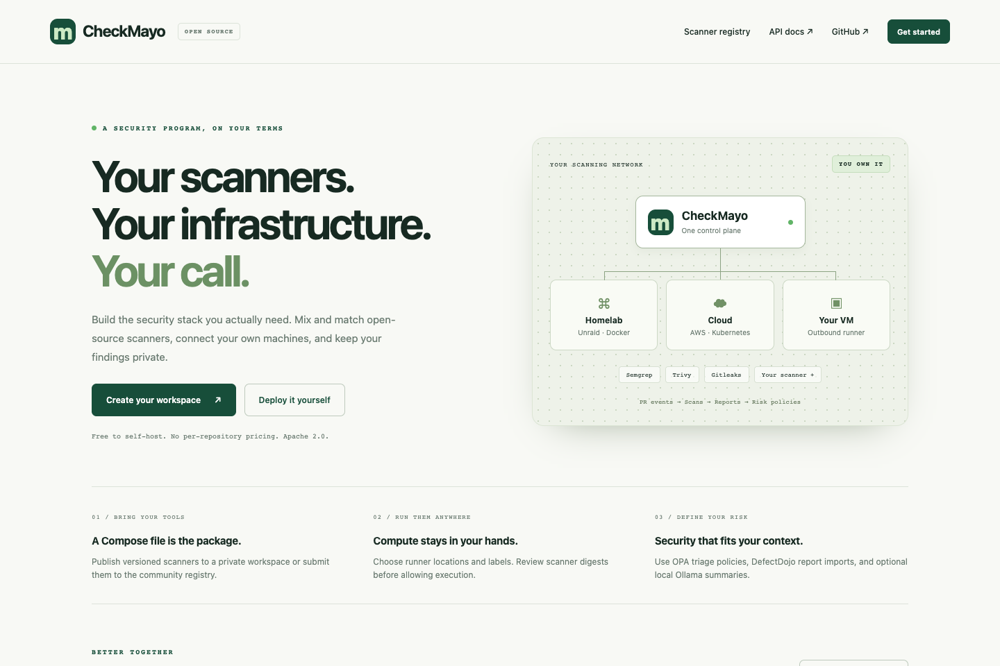
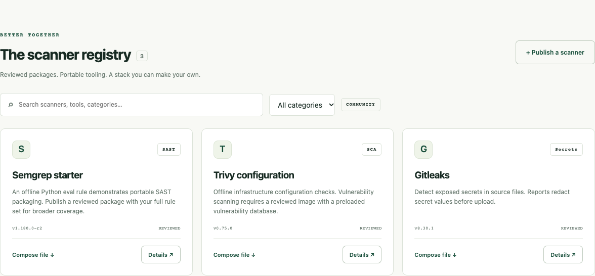
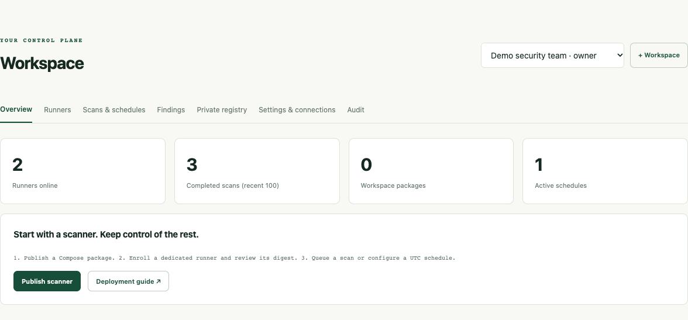
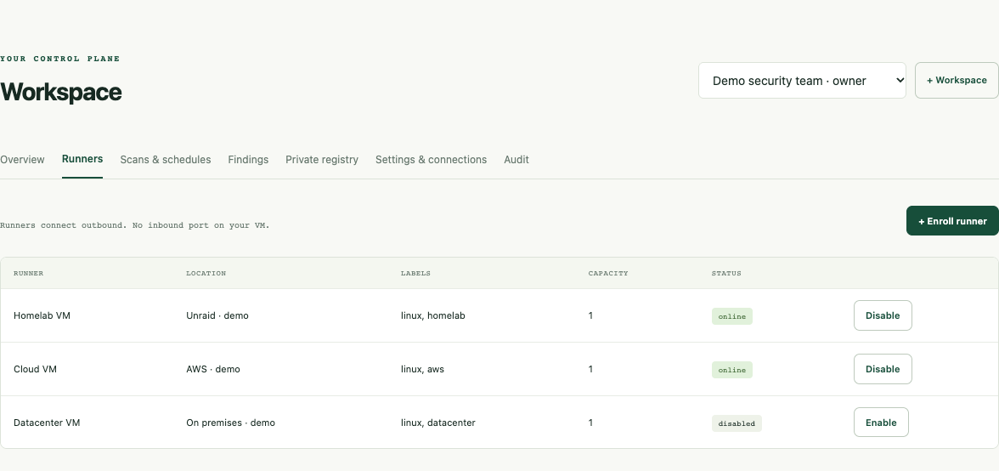
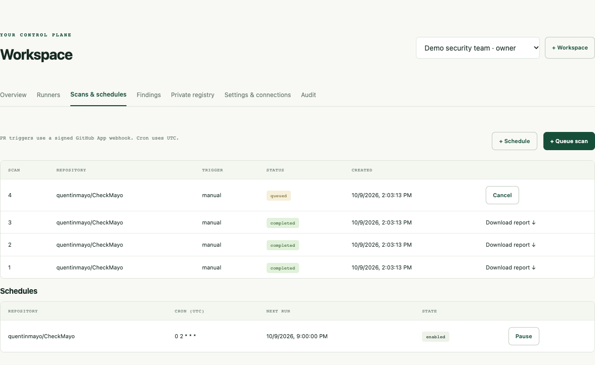
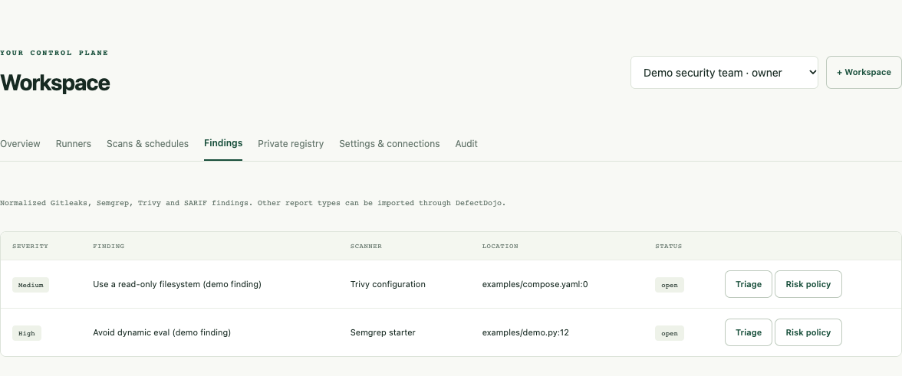
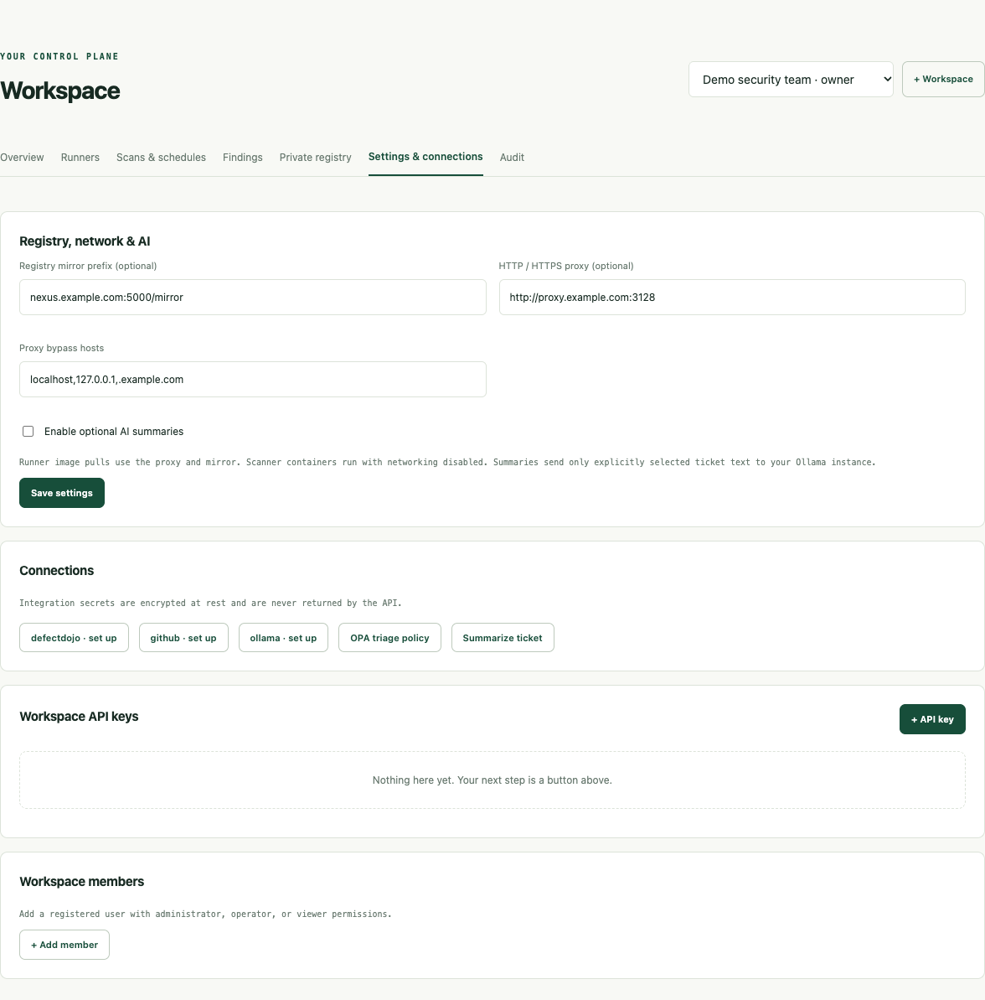
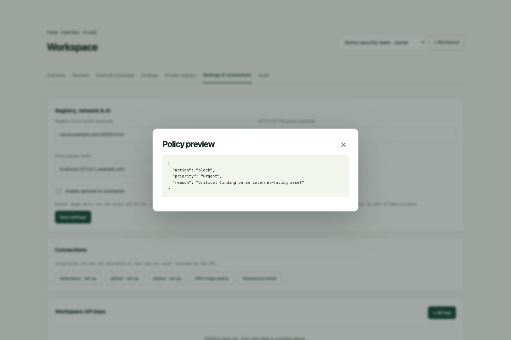

# CheckMayo screenshots

Captured from the running CheckMayo v0.1 preview on October 9, 2026. These are unmodified browser screenshots of a disposable local controller using SQLite and a **Demo security team** workspace. Runner names and locations are examples; scan jobs and findings use synthetic reports submitted through the runner API. They illustrate the interface and do not represent live cloud connections or a security assessment. The policy preview was evaluated by the actual OPA engine.

No real customer accounts, infrastructure credentials, API keys, private repositories, or private reports appear in these images. The demo controller, accounts, temporary credentials, and database were removed after capture.

## Landing page

The public entry point introduces the scanner network and self-hosting.

## Community scanner registry

Search reviewed packages, download Compose files, and inspect package details.

## Workspace overview

A workspace groups runners, scanner packages, scan jobs, and schedules.

## Runner locations

Use locations and labels to route jobs among your machines; enable or disable enrolled runners.

## Scans and schedules

Queue scans, download reports, cancel jobs, and pause or resume UTC schedules.

## Findings

Review normalized findings and record triage decisions.

## Settings and connections

Configure an image mirror or proxy, manage integrations and access, and opt into AI.

## OPA policy preview

Evaluate a Rego policy with example input before saving it.

