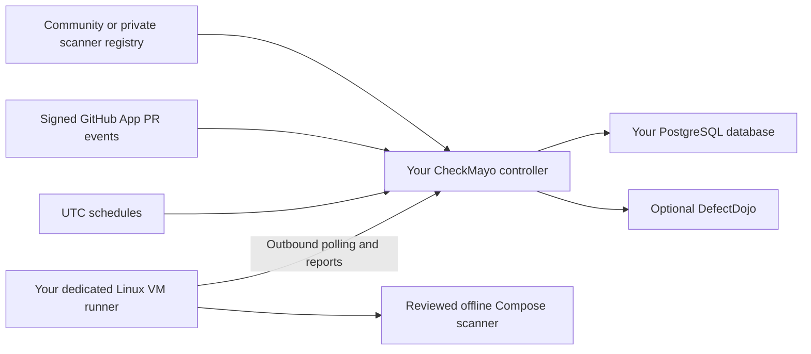

CheckMayo is a free, Apache 2.0 security orchestration platform for personal accounts and teams. Package scanners as Docker Compose files, run them on your own dedicated machines, and keep reports in your own database.

**v0.1 preview:** read the [compatibility and testing guide](https://github.com/quentinmayo/CheckMayo/wiki/Compatibility-and-Testing) for implemented features, executed tests, and current limits.

## Start here

| Guide | What it covers |
| --- | --- |
| [Getting started](https://github.com/quentinmayo/CheckMayo/wiki/Getting-Started) | Install a controller, choose storage, and prepare your first scan |
| [Screenshots](https://github.com/quentinmayo/CheckMayo/wiki/Screenshots) | Tour the registry, runner management, scans, findings, and settings |
| [Deployments](https://github.com/quentinmayo/CheckMayo/wiki/Deployments) | Docker Compose, Unraid, Coolify, Kubernetes, EC2, ECS, and EKS |
| [Scanner packages](https://github.com/quentinmayo/CheckMayo/wiki/Scanner-Packages) | Compose contract, private/community registries, mirrors, and package review |
| [Runners](https://github.com/quentinmayo/CheckMayo/wiki/Runners) | Connect dedicated Linux VMs, select labels, and control execution |
| [PR and scheduled scans](https://github.com/quentinmayo/CheckMayo/wiki/PR-and-Scheduled-Scans) | Manual jobs, GitHub App events, UTC cron, reports, and cancellation |
| [Findings and risk policies](https://github.com/quentinmayo/CheckMayo/wiki/Findings-and-Risk-Policies) | Triage, deduplication, Rego previews, and optional AI |
| [Authentication and roles](https://github.com/quentinmayo/CheckMayo/wiki/Authentication-and-Roles) | Local accounts, OIDC, LDAPS, access levels, and live identity tests |
| [API and integrations](https://github.com/quentinmayo/CheckMayo/wiki/API-and-Integrations) | Swagger, workspace keys, GitHub, DefectDojo, and Ollama |
| [Compatibility and testing](https://github.com/quentinmayo/CheckMayo/wiki/Compatibility-and-Testing) | Scanner coverage, deployment evidence, and preview limitations |

## Pick the right service

The [hosted community registry](https://checkmayo.programmingsecurely.com) lets you discover and share scanner packages. Deploy your own **controller** to enroll runners, execute scans, configure integrations, and store private reports. The hosted registry intentionally disables these controller operations.

The runner connects outbound and executes reviewed packages only after their digests have been explicitly trusted on that host. Scanner containers do not receive the controller's credentials or Docker socket.

## Community

[Source code](https://github.com/quentinmayo/CheckMayo) · [Report an issue](https://github.com/quentinmayo/CheckMayo/issues) · [Contributing](https://github.com/quentinmayo/CheckMayo/blob/main/CONTRIBUTING.md) · [Security policy](https://github.com/quentinmayo/CheckMayo/blob/main/SECURITY.md)

Want additional managed tooling? Explore [MayoASPM](https://mayoaspm.com/). To support open-source development, [buy the developers a coffee](https://buymeacoffee.com/quentinmayo).

Wiki sources are versioned in [docs/wiki](https://github.com/quentinmayo/CheckMayo/blob/main/docs/wiki). Maintainers publish reviewed changes with `bash scripts/publish-wiki.sh`.
